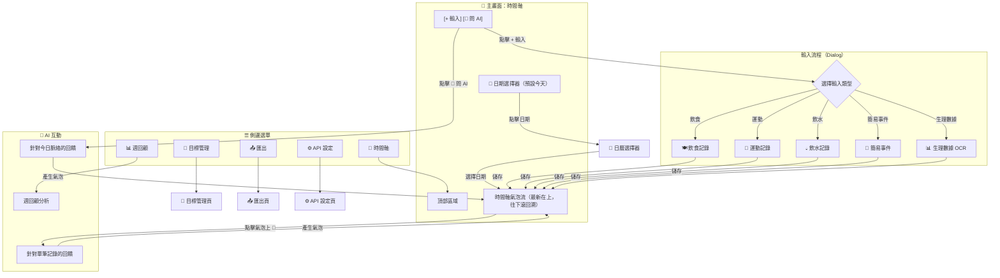

# UI 規格 - Body Hack

> 最後更新：2025-02-03
> 狀態：設計中（飲食記錄已完成，其他待設計）

---

## 1. 設計理念

### 1.1 核心體驗

| 優先級 | 功能 | 設計方向 |
|--------|------|----------|
| 🥇 最高 | 輸入（記錄） | 極低摩擦、OCR 優先、一鍵觸發 |
| 🥈 次高 | 檢視脈絡 | 時間軸呈現，最新在上 |
| 🥉 第三 | AI 討論 | 按需觸發，不強迫 |

### 1.2 介面概念：倒轉的 Messenger

- 時間軸為主軸，每筆記錄是一個「氣泡」
- 最新記錄在最上方，往下滾是回溯過去
- AI 回饋也是氣泡，但用不同樣式區分
- 頂部固定「輸入」按鈕，隨時可記錄

---

## 2. 畫面流程總覽



---

## 3. 畫面清單

| 畫面 | 類型 | 狀態 | 說明 |
|------|------|------|------|
| 時間軸 | 主頁面 | 📐 已設計 | 核心畫面，顯示所有記錄 |
| 飲食記錄 | Dialog | ✅ 已確認 | 三段式輸入 + AI 整理 |
| 運動記錄 | Dialog | ⏳ 待設計 | — |
| 飲水記錄 | Dialog | ⏳ 待設計 | — |
| 簡易事件 | Dialog | ⏳ 待設計 | — |
| 生理數據 OCR | Dialog | ⏳ 待設計 | CGM/Garmin/血壓計/體脂計 |
| 目標管理 | 頁面 | ⏳ 待設計 | — |
| 匯出 | 頁面 | ⏳ 待設計 | — |
| 週回顧 | 頁面 | ⏳ 待設計 | — |
| API 設定 | 頁面 | ⏳ 待設計 | 模型選擇、測試連線 |

---

## 4. 主畫面：時間軸

### 4.1 版面配置

```
┌─────────────────────────────────────┐
│ ☰  Body Hack              [⚙️]     │  ← 頂部列：漢堡選單、標題、設定
├─────────────────────────────────────┤
│  📅 2025-02-03（一）       [今天]   │  ← 日期選擇：點擊開啟日曆
├─────────────────────────────────────┤
│  [+ 輸入]           [🤖 問 AI]      │  ← 主要動作按鈕
├─────────────────────────────────────┤
│                                     │
│  ┌─────────────────────────────┐   │
│  │ 14:30 🍽️ 午餐               │   │  ← 最新記錄
│  │ 雞腿便當：雞腿、白飯(1/4碗)  │   │
│  │ [🤖]                        │   │  ← 點擊可問 AI
│  └─────────────────────────────┘   │
│                                     │
│  ┌─────────────────────────────┐   │
│  │ 14:35 🤖 AI 回饋            │   │  ← AI 回饋氣泡（不同樣式）
│  │ 這餐蛋白質不錯...            │   │
│  └─────────────────────────────┘   │
│                                     │
│  ┌─────────────────────────────┐   │
│  │ 12:00 📊 血糖 105 →         │   │
│  │ LibreLink OCR               │   │
│  │ [🤖]                        │   │
│  └─────────────────────────────┘   │
│                                     │
│         ⬇️ 往下滾 = 回溯過去        │
│                                     │
└─────────────────────────────────────┘
```

### 4.2 互動行為

| 元素 | 動作 | 結果 |
|------|------|------|
| ☰ 漢堡選單 | 點擊 | 展開側邊選單 |
| 📅 日期 | 點擊 | 開啟日曆選擇器 |
| [今天] | 點擊 | 跳回今天 |
| [+ 輸入] | 點擊 | 開啟輸入類型選擇 Dialog |
| [🤖 問 AI] | 點擊 | AI 針對今日脈絡回饋 |
| 氣泡上的 [🤖] | 點擊 | AI 針對該筆記錄回饋 |
| 時間軸 | 往下滾 | 載入更早的記錄 |

### 4.3 氣泡樣式

| 類型 | 圖示 | 背景色 | 說明 |
|------|------|--------|------|
| 飲食 | 🍽️ | 淺綠 | — |
| 運動 | 🏃 | 淺藍 | — |
| 飲水 | 💧 | 淺青 | — |
| 簡易事件 | 📝 | 淺灰 | — |
| 生理數據 | 📊 | 淺紫 | — |
| AI 回饋 | 🤖 | 淺橙 | 視覺上明顯區分 |

---

## 5. 輸入類型選擇

### 5.1 Dialog 內容

```
┌─────────────────────────────────────┐
│         選擇輸入類型          [✕]   │
├─────────────────────────────────────┤
│                                     │
│  ┌─────────┐  ┌─────────┐          │
│  │  🍽️    │  │  🏃    │          │
│  │  飲食   │  │  運動   │          │
│  └─────────┘  └─────────┘          │
│                                     │
│  ┌─────────┐  ┌─────────┐          │
│  │  💧    │  │  📝    │          │
│  │  飲水   │  │  事件   │          │
│  └─────────┘  └─────────┘          │
│                                     │
│  ┌─────────────────────────┐       │
│  │  📊 生理數據（OCR）      │       │
│  └─────────────────────────┘       │
│                                     │
└─────────────────────────────────────┘
```

---

## 6. 飲食記錄（已確認 ✅）

### 6.1 資料結構

| 欄位 | 必填 | 型別 | 說明 | 範例 |
|------|------|------|------|------|
| datetime | ✅ | string | ISO 8601 | `2025-02-03T14:30:00` |
| category | ✅ | string | 固定值 | `meal` |
| sub_category | ✅ | string | 餐別 | `早餐`/`午餐`/`晚餐`/`其他` |
| content | ✅ | string | 餐點內容（含份量描述） | `雞腿便當：雞腿、白飯(1/4碗)、炒青菜、滷蛋` |
| note | ⬜ | string | 營養資訊 | `熱量450kcal...` 或 `[推估] 熱量約500kcal...` |

### 6.2 欄位定位

| 欄位 | 放什麼 | 範例 |
|------|--------|------|
| **content** | 吃了什麼、怎麼吃的 | `豬肉味噌湯(喝半碗料吃完)` |
| **note** | 營養標示資訊 | `熱量180kcal、蛋白質12g` 或 `[推估] 熱量約200kcal` |

### 6.3 UI 版面

```
┌─────────────────────────────────────────┐
│           🍽️ 記錄飲食            [✕]    │
├─────────────────────────────────────────┤
│                                         │
│  ⏰ 時間                                 │
│  ┌───────────────┐                      │
│  │ 14:30         │  [現在]              │  ← 預設現在，可改
│  └───────────────┘                      │
│                                         │
│  📅 餐別                                 │
│  ┌──────┬──────┬──────┬──────┐         │
│  │ 早餐 │ 午餐 │ 晚餐 │ 其他 │         │  ← st.pills，必選
│  └──────┴──────┴──────┴──────┘         │
│  （選「其他」時顯示輸入框）              │
│                                         │
├─────────────────────────────────────────┤
│  📝 文字描述（選填）                     │
│  ┌─────────────────────────────────┐   │
│  │                                 │   │
│  └─────────────────────────────────┘   │
│                                         │
│  📷 照片辨識（選填）                     │
│  [上傳照片]                             │
│  ┌─────────┐ ┌─────────┐               │
│  │ 🖼️ [✕] │ │ 🖼️ [✕] │               │  ← 縮圖，可刪除
│  └─────────┘ └─────────┘               │
│                                         │
│  [🔍 辨識照片]                          │  ← 點擊呼叫 Gemini
│  ┌─────────────────────────────────┐   │
│  │ （辨識結果顯示於此，不可編輯）   │   │
│  └─────────────────────────────────┘   │
│                                         │
│  💬 備註（選填）                         │
│  ┌─────────────────────────────────┐   │
│  │ 飯只吃 1/4，青菜沒吃完           │   │  ← 份量、口味等補充
│  └─────────────────────────────────┘   │
│                                         │
│              [✨ 整理]                   │  ← 魔法按鈕
│                                         │
├─────────────────────────────────────────┤
│  📋 內容預覽                             │
│  ┌─────────────────────────────────┐   │
│  │ 雞腿便當：雞腿、白飯(1/4碗)、    │   │  ← 可直接編輯
│  │ 炒青菜(部分)、滷蛋               │   │
│  └─────────────────────────────────┘   │
│                                         │
│  📊 營養資訊（選填）                     │
│  ┌─────────────────────────────────┐   │
│  │                                 │   │  ← 可直接編輯
│  └─────────────────────────────────┘   │
│  [📷 辨識營養標籤]    [🤖 AI 推估]      │
│                                         │
│              [💾 儲存]                   │
│                                         │
└─────────────────────────────────────────┘
```

### 6.4 操作流程

| 步驟 | 使用者動作 | 系統行為 |
|------|------------|----------|
| 1 | 設定時間 | 預設現在 |
| 2 | 選擇餐別 | 必選（早餐/午餐/晚餐/其他） |
| 3 | 填寫文字描述（選填） | 暫存 |
| 4 | 上傳照片（選填） | 顯示縮圖 |
| 5 | 點「🔍 辨識照片」 | 呼叫 Gemini，萃取文字到辨識結果區 |
| 6 | 填寫備註（選填） | 暫存 |
| 7 | 點「✨ 整理」 | 呼叫 Gemini，合併三個輸入框，輸出到內容預覽 |
| 8 | 編輯內容預覽（如需） | 直接修改文字 |
| 9 | 輸入營養資訊（選填） | 手動輸入 / OCR 營養標籤 / AI 推估 |
| 10 | 點「💾 儲存」 | 驗證必填 → 寫入 Google Sheets |

### 6.5 驗證規則

| 檢查 | 條件 | 錯誤訊息 |
|------|------|----------|
| 餐別必填 | sub_category 為空 | 「請選擇餐別」 |
| 內容必填 | content 為空 | 「請輸入或整理餐點內容」 |
| 三個輸入至少一個 | 文字描述、照片、備註都空，且按「整理」 | 「請至少輸入一項內容」 |

### 6.6 AI Prompt 設計

#### 照片辨識 Prompt

```
你是一個飲食記錄助手。請從這張照片中辨識食物內容。

【任務】
- 如果是餐點照片：列出看到的食物品項
- 如果是菜單/明細：擷取餐點名稱
- 如果是營養標示：這不是此功能的用途，請提示使用者使用「辨識營養標籤」功能

【輸出格式】
直接列出食物品項，用頓號分隔，例如：
雞腿、白飯、炒青菜、滷蛋

【注意】
- 只列出看到的內容，不要推測
- 如果無法辨識，回覆「無法辨識照片內容」
```

#### 整理 Prompt

```
你是一個飲食記錄助手。請將以下輸入整理成一段簡潔的飲食記錄。

【輸入】
- 文字描述：{text_input}
- 照片辨識結果：{ocr_result}
- 備註：{note}

【輸出格式】
{餐點名稱}：{食材1}、{食材2}（{備註}）、{食材3}...

【範例】
- 雞腿便當：雞腿、白飯（1/4碗）、炒青菜（部分）、滷蛋
- 7-11 御飯糰：鮭魚、白飯（1個）
- 星巴克：美式咖啡（中杯）、可頌

【注意】
- 份量、口味等備註用括號標註在對應食材後
- 保持簡潔，便於日後分析
- 如果輸入資訊不足，根據已有資訊盡量整理
```

#### 營養推估 Prompt

```
你是一個營養師助手。請根據以下餐點內容，推估營養成分。

【餐點內容】
{content}

【輸出格式】
[推估] 熱量約{X}kcal、蛋白質約{X}g、碳水約{X}g、脂肪約{X}g

【注意】
- 這是推估值，請給出合理範圍
- 如果有明確份量（如 1/4 碗），請據此調整
- 開頭務必標註 [推估]，與實際營養標示區分
```

---

## 7. 運動記錄（待設計 ⏳）

> 待與產品負責人確認設計

---

## 8. 飲水記錄（待設計 ⏳）

> 待與產品負責人確認設計

---

## 9. 簡易事件（待設計 ⏳）

> 待與產品負責人確認設計

---

## 10. 生理數據 OCR（待設計 ⏳）

> 待與產品負責人確認設計

---

## 11. 目標管理（待設計 ⏳）

> 待與產品負責人確認設計

---

## 12. 匯出（待設計 ⏳）

> 待與產品負責人確認設計

---

## 13. 週回顧（待設計 ⏳）

> 待與產品負責人確認設計

---

## 14. API 設定（待設計 ⏳）

> 待與產品負責人確認設計
> 已確認需求：可切換 Gemini 模型（測試階段避免用最貴的 API）

---

## 15. 技術備註

### 15.1 Streamlit 元件對應

| UI 需求 | Streamlit 元件 |
|---------|----------------|
| Dialog 彈窗 | `st.dialog` |
| 餐別選擇 | `st.pills` |
| 時間選擇 | `st.time_input` |
| 文字輸入 | `st.text_area` |
| 照片上傳 | `st.file_uploader` |
| 按鈕 | `st.button` |
| 側邊選單 | `st.sidebar` |
| 時間軸氣泡 | `st.chat_message` + `@st.fragment` |
| 串流輸出 | `st.write_stream` |
| 短暫通知 | `st.toast` |

### 15.2 注意事項

- Dialog 內使用 `st.form` 包裝，避免每個輸入都觸發 re-run
- 時間軸使用 `@st.fragment` 實現局部更新
- 圖片上傳後立即處理並釋放，不存入 session_state
- AI 呼叫加上 `st.spinner` 顯示處理中

---

## 附錄 A：設計決策紀錄

| 日期 | 決策 | 原因 |
|------|------|------|
| 2025-02-03 | 時間軸採用「最新在上」 | 符合使用者「倒轉 Messenger」的心智模型 |
| 2025-02-03 | 輸入使用 Dialog 而非獨立頁面 | 減少頁面跳轉，保持脈絡 |
| 2025-02-03 | 飲食記錄採用三段式輸入 + AI 整理 | 兼顧低摩擦與資料品質 |
| 2025-02-03 | 營養資訊存在 note 欄位 | PoC 階段簡化設計，之後可優化 |
| 2025-02-03 | AI 推估標註 [推估] | 區分實際標示與推估值，保持資料可信度 |
