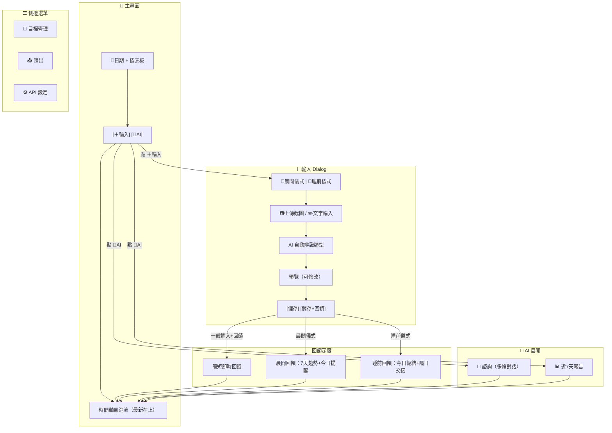

# UI 規格 - Body Hack

> 最後更新：2025-02-04 by May

---

## 設計理念

### 三種使用情境

| 情境 | 使用者意圖 | AI 角色 | 頻率 |
|------|-----------|---------|------|
| **輸入** | 我做了某事 / 我的狀態是... | 記錄 + 即時回饋 | 最高（日常） |
| **諮詢** | 我想問... / 這個能吃嗎？ | 基於脈絡回答 | 中（隨時） |
| **檢討** | 我這段時間表現如何？ | 總結 + 評價 + 建議 | 低（週） |

### 核心原則

1. **一個輸入入口，AI 自動辨識**：降低操作摩擦
2. **情境決定回饋深度**：根據時間和內容智慧判斷
3. **儀式創造覺察**：晨間/睡前儀式強化行為意識

---

## 畫面流程總覽


---

## 主畫面

### 頂部區域
```
┌─────────────────────────────────┐
│  📅 2/4    💧2000ml 🍽2餐 🚬3根 │
│  ─────────────────────────────  │
│         [＋ 輸入]    [🤖 AI]    │
├─────────────────────────────────┤
```

| 元素 | 說明 |
|------|------|
| 📅 日期 | 點擊開啟日曆，跳到特定日期 |
| 儀表板 | 顯示今日目標執行進度 |
| [＋ 輸入] | 開啟輸入 Dialog |
| [🤖 AI] | 展開諮詢/檢討選項 |

### 儀表板項目

| 項目 | 單位 | 顯示方式 | 目標來源 |
|------|------|----------|----------|
| 💧 飲水 | 毫升 | 2000/3000ml | 目標管理頁設定 |
| 🍽 正餐 | 次數 | 2/3 餐 | 目標管理頁設定 |
| 🚬 吸菸 | 次數 | 3 根 | 純累計，不設目標 |

### 時間軸

- **排序**：最新在上，往下滾回溯
- **氣泡類型**：
  - 使用者輸入（各類型有不同圖示）
  - AI 回饋（不同樣式區分）
  - AI 對話（可展開/收合）

---

## ＋ 輸入 Dialog

### UI 結構
```
┌─────────────────────────────────┐
│  ＋ 輸入                  [✕]  │
├─────────────────────────────────┤
│                                 │
│  🌅 晨間儀式    🌙 睡前儀式     │
│  ─────────────────────────────  │
│                                 │
│  📷 上傳截圖                    │
│  ┌─────────────────────────┐   │
│  │      [點擊上傳]         │   │
│  └─────────────────────────┘   │
│                                 │
│  ── 或直接輸入 ──               │
│  ┌─────────────────────────┐   │
│  │ 輸入文字描述...          │   │
│  └─────────────────────────┘   │
│                                 │
│  💡 可以混合：截圖 + 文字補充   │
│                                 │
├─────────────────────────────────┤
│            [✨ 送出]            │
└─────────────────────────────────┘
```

### AI 辨識後預覽
```
┌─────────────────────────────────┐
│  ✨ AI 整理結果            [✕] │
├─────────────────────────────────┤
│                                 │
│  識別為：🍽 飲食                │
│  ─────────────────────────────  │
│  餐別：午餐                     │
│  內容：雞胸肉便當               │
│  澱粉：約 1/2 碗                │
│  營養：[推估] 蛋白質35g 碳水40g │
│  ─────────────────────────────  │
│                                 │
│  [✏️ 修改]                      │
│                                 │
├─────────────────────────────────┤
│   [取消]    [✓ 儲存]  [💬 回饋] │
└─────────────────────────────────┘
```

### AI 可辨識的輸入類型

| 輸入內容 | 辨識類型 | 存到 |
|----------|----------|------|
| 體重/體脂截圖 | weight | Physio Sheet |
| 血壓截圖 | blood_pressure | Physio Sheet |
| 睡眠截圖 | sleep | Physio Sheet |
| 血糖截圖 | glucose | Physio Sheet |
| HRV 截圖 | hrv | Physio Sheet |
| 運動截圖 | exercise | Structured_Events |
| 步數截圖 | steps | Structured_Events |
| 樓層數截圖 | floors | Structured_Events |
| 飲食描述/照片 | meal | Structured_Events |
| 飲水描述 | water | Structured_Events |
| 吸菸/情緒/壓力 | simple_event | Simple_Events |

---

## 儀式模式

### 晨間儀式 🌅

**觸發**：點擊「🌅 晨間儀式」

**預期輸入**：
- 體重/體脂
- 血壓
- 睡眠數據

**AI 回饋內容**：
- 7 天趨勢分析
- 今日目標提醒
- 正向鼓勵

**保存**：自動保存至 Insights Sheet（type: `morning_ritual`）

### 睡前儀式 🌙

**觸發**：點擊「🌙 睡前儀式」

**預期輸入**：
- 血壓
- 步數
- 樓層數

**AI 回饋內容**：
- 今日總結
- 目標達成評價
- 隔日交接事項

**保存**：自動保存至 Insights Sheet（type: `night_ritual`）

### 儀式回饋保存結構
```json
{
  "timestamp": "2025-02-04 07:30",
  "type": "morning_ritual",
  "findings": "體重連續3天下降，血壓維持穩定",
  "suggestions": "今日蛋白質攝取可增加，注意補充水分",
  "goals": "飲水目標 3000ml、控制澱粉在 1 碗內",
  "summary": "整體趨勢良好，持續保持！"
}
```

| 欄位 | 說明 |
|------|------|
| findings | 重點發現 |
| suggestions | 建議事項 |
| goals | 當日/隔日目標 |
| summary | 一句話摘要 |

---

## 🤖 AI 功能

### 展開選項
```
┌─────────────────────────────────┐
│  💬 諮詢                        │
│  📊 近 7 天報告                 │
└─────────────────────────────────┘
```

### 💬 諮詢

**功能**：多輪對話，可問任何健康相關問題

**AI 帶入的脈絡**：
- 今日所有記錄（詳細）
- 近 7 日摘要（每日一句）
- 當前進行中的目標

**Dialog UI**：
```
┌─────────────────────────────────┐
│  🤖 AI 助手              [✕]   │
├─────────────────────────────────┤
│  ┌─ 今日脈絡 ─────────────┐    │
│  │ 早餐：黑咖啡            │    │
│  │ 午餐：雞胸肉便當        │    │
│  │ 血糖：92→105→98        │    │
│  └─────────────────────────┘    │
│                                 │
│  💬 你的問題                    │
│  🤖 AI 回答                     │
│  💬 追問                        │
│  🤖 AI 回答                     │
│                                 │
├─────────────────────────────────┤
│  [輸入問題...]          [送出] │
├─────────────────────────────────┤
│  [結束對話]    [📝 保存對話]   │
└─────────────────────────────────┘
```

**保存**：結束時問使用者「要保存這段對話嗎？」

### 📊 近 7 天報告

**功能**：回顧過去 7 天的表現

**AI 回饋內容**：
- 各項目標達成率
- 趨勢分析
- 亮點與改進建議

**保存**：生成後問使用者「要保存這份報告嗎？」

---

## 飲食記錄細節

### 輸入方式

支援三種輸入：
1. 純文字：「午餐吃了雞胸肉便當，飯半碗」
2. 純照片：拍餐點照片或菜單
3. 混合：照片 + 文字補充

### AI 整理後的欄位

| 欄位 | 說明 | 範例 |
|------|------|------|
| meal_type | 餐別 | 早餐/午餐/晚餐/其他 |
| content | 餐點內容 + 份量 | 雞胸肉便當，飯半碗 |
| note | 營養資訊 | [推估] 蛋白質35g 碳水40g |

### 營養資訊標記

- `[推估]`：AI 推估的營養資訊
- 無標記：來自實際標示（如包裝營養標籤）

---

## 飲水記錄細節

### 輸入方式

文字描述即可：「喝了 1000ml 水」「喝了一杯咖啡」

### AI 辨識的欄位

| 欄位 | 說明 | 範例 |
|------|------|------|
| drink_type | 飲品類型 | 水/咖啡/茶/氣泡水/其他 |
| amount_ml | 容量 | 1000 |

### 智慧預設

AI 會根據常見用語推估：
- 「一杯水」→ 250ml
- 「水壺」→ 可學習使用者習慣（如你的 1000ml）

---

## 運動記錄細節

### 輸入方式

上傳 Garmin 截圖（總覽頁）

### 支援的運動類型

| 類型 | subcategory | 關鍵欄位 |
|------|-------------|----------|
| 跑步 | running | 距離、時間、配速、心率、卡路里 |
| 跑步機 | treadmill | 同上 |
| 健行 | hiking | 距離、時間、配速、心率、卡路里、爬升 |
| 步行 | walking | 距離、時間、配速、心率、卡路里、步數 |
| 騎乘 | cycling | 距離、時間、速度、心率、卡路里 |
| 步數 | steps | 步數、距離、卡路里 |
| 樓層數 | floors | 上樓層數、下樓層數 |

### 時間處理

使用截圖上的活動時間，非上傳時間

---

## 生理數據 OCR 細節

### 支援的數據類型

| 類型 | 來源 | 關鍵欄位 |
|------|------|----------|
| 血糖 | 亞培 CGM | 數值、趨勢、時間 |
| 血壓 | Garmin | 收縮壓、舒張壓、心率、狀態 |
| 體重/體脂 | Garmin | 體重、BMI、體脂肪、骨骼肌肉量 |
| 睡眠 | Garmin | 分數、時長、深層/淺層/REM、靜止心率 |
| HRV | Garmin | 7天平均、夜間平均、狀態 |

### 血糖特殊處理

- 支援單點截圖和整天記錄本
- AI 自動判斷截圖類型
- 「這個能吃嗎？」功能會帶入今日所有血糖記錄

---

## 簡易事件細節

### 輸入方式

文字描述：「剛抽了一根菸」「壓力有點大」

### 預設類別

| 類別 | 圖示 | 可刪除 |
|------|------|--------|
| 吸菸 | 🚬 | ✅ |
| 壓力 | 😰 | ✅ |
| 情緒 | 😊 | ✅ |

### 自訂類別

使用者可新增，輸入過的會保留為建議選項

---

## 側邊選單
```
☰ 選單
├── 🎯 目標管理
├── 📤 匯出
└── ⚙️ API 設定
```

### 🎯 目標管理

設定儀表板追蹤的目標：
- 每日飲水量（ml）
- 每日正餐數
- 其他自訂目標

### 📤 匯出

- 選擇時間範圍
- 匯出 CSV
- 自動產生 Skill 啟動 Prompt

### ⚙️ API 設定

- 選擇 Gemini 模型（Flash / Pro）
- 測試連線

---

## 畫面清單索引

| 畫面 | 說明 | 對應場景 |
|------|------|----------|
| 主畫面 | 時間軸 + 儀表板 | specs/timeline.feature |
| 輸入 Dialog | 統一輸入入口 | specs/input.feature |
| AI 諮詢 Dialog | 多輪對話 | specs/ai_consult.feature |
| 近 7 天報告 | 週度檢討 | specs/ai_review.feature |
| 目標管理 | 設定目標 | specs/goals.feature |
| 匯出 | CSV + Prompt | specs/export.feature |
| API 設定 | 模型選擇 | specs/settings.feature |
